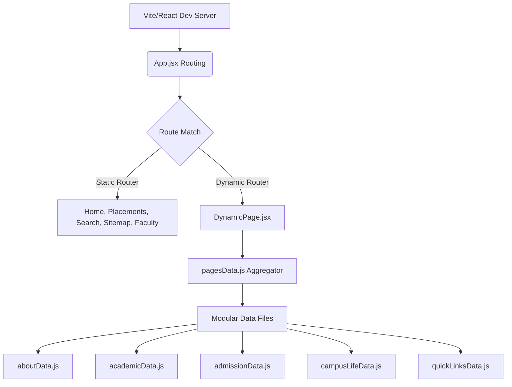

<div align="center">
  

  # MSIT — Maharaja Surajmal Institute of Technology
  
  **A high-performance, fully accessible, and premium modern redesign of the MSIT web platform.**
  *Engineered with React 19, Vite 7, Tailwind CSS 4, and GSAP.*

  [](https://msit-website.netlify.app/)
  [](https://react.dev/)
  [](https://vitejs.dev/)
  [](https://tailwindcss.com/)
  [](https://greensock.com/gsap/)

</div>

---

## 📖 Project Overview

This repository hosts the state-of-the-art visual redesign and architectural rebuild of the Maharaja Surajmal Institute of Technology (MSIT) website. Originally serving as a standard institutional portal, this platform has been completely reimagined as a premium **Single Page Application (SPA)** that prioritizes visual elegance (glassmorphism), sub-second load times, inclusive accessibility, and dynamic page indexing.

> [!NOTE]
> This is a **conceptual portfolio redesign** built to demonstrate modern frontend engineering best practices. The official website of MSIT is located at [msit.in](http://www.msit.in).

---

## ✨ Features & Highlights

### ⚡ Dynamic Page Engine
The site is built on a custom data-driven rendering layout ([DynamicPage.jsx](file:///Users/jayantolhyan/Desktop/my%20projects/deployed/msit%20website/src/pages/DynamicPage.jsx)). Rather than hardcoding dozens of separate pages, we decouple the page structure from the copy.
* **Modularized Data**: Every department (CSE, IT, ECE, EEE), admissions circular, rules page, and student society is stored as a clean, structured object in [src/data/pages/](file:///Users/jayantolhyan/Desktop/my%20projects/deployed/msit%20website/src/data/pages/).
* **SEO Hydration**: Dynamically injects title, description, and canonical path tags on load using `react-helmet-async`.
* **Stats & Highlights Sidebar**: Pages automatically render key statistics and bullet points based on the underlying page schema.

### 🔍 Unified Search Indexing & Sitemap Parity
A robust, instantly searchable dictionary tracks keywords, page content, and department listings locally.
* **Instant Client-Side Search**: Users can find pages, departments, and specific teachers in milliseconds via [SearchPage.jsx](file:///Users/jayantolhyan/Desktop/my%20projects/deployed/msit%20website/src/pages/SearchPage.jsx).
* **Parity Synchronization**: Both [searchIndex.js](file:///Users/jayantolhyan/Desktop/my%20projects/deployed/msit%20website/src/data/searchIndex.js) and the Apple-inspired dynamic [Sitemap.jsx](file:///Users/jayantolhyan/Desktop/my%20projects/deployed/msit%20website/src/pages/Sitemap.jsx) are completely aligned to ensure that 100% of website pages are easily reachable and fully indexed.

### 🎨 Inclusive Accessibility (A11y) Engine
Equipped with a global accessibility controller (`AccessibilityContext`) allowing visitors to:
* Increase/decrease font sizes dynamically for readability.
* Toggle between standard styling, high-contrast black-and-white, and specialized color-filtered modes.
* Keyboard-navigable skip-to-content anchors and fully focusable semantic tags.

---

## 🏗️ Technical Architecture



---

## 🛠 Tech Stack

* **Library**: React 19 (Hooks, lazy loading, Suspense fallbacks)
* **Build Tooling**: Vite 7 (Instant HMR, ES module resolution)
* **Styling**: Tailwind CSS 4 (Centralized theme variables & CSS configuration)
* **Routing**: React Router v7 (Fluid SPA navigation)
* **Animations**: GSAP (Hardware-accelerated layout transitions & card hover reveals)
* **Icons**: Lucide React
* **Static Generation**: `vite-plugin-sitemap`

---

## 📂 Project Structure

```bash
msit-website/
├── public/                 # Static assets (logos, campus images, fallback illustrations)
├── src/
│   ├── components/         # Reusable structural units (Header, Footer, Layout, PageHero, Spinner)
│   ├── context/            # Accessibility & Theme state providers
│   ├── data/
│   │   ├── pages/          # Modular content split by domain (about, admissions, academics)
│   │   ├── facultyData.js  # Rich staff lists and research specialties
│   │   ├── searchIndex.js  # Search keywords map with 100% sitemap parity
│   │   └── pagesData.js    # Data bundler for dynamic slugs
│   ├── pages/              # Primary routing views (Home, Placements, DynamicPage, Sitemap)
│   ├── App.jsx             # Main router configuration & layout structure
│   └── main.jsx            # Mounting point & Tailwind import base
├── netlify.toml            # Production redirects & security headers configuration
└── package.json            # Scripts & project dependencies
```

---

## ⚙️ Development Guide

### Prerequisites
* **Node.js**: `v20.0.0` or higher
* **npm**: `v10.0.0` or higher

### Local Setup
1. **Clone the repository**:
   ```bash
   git clone https://github.com/JayantOlhyan/MSIT-.git
   cd MSIT-
   ```
2. **Install node dependencies**:
   ```bash
   npm install
   ```
3. **Run the local dev server**:
   ```bash
   npm run dev
   ```
4. **Compile the production build**:
   ```bash
   npm run build
   ```

---

## 🤝 Contributing & License

Contributions are welcome. For major changes, please open an issue first to discuss your proposed updates.

* **License**: [MIT](LICENSE)
* **Author**: [Jayant Olhyan](https://github.com/JayantOlhyan)

<div align="center">
  <sub>Built with ❤️ for Maharaja Surajmal Institute of Technology</sub>
</div>
