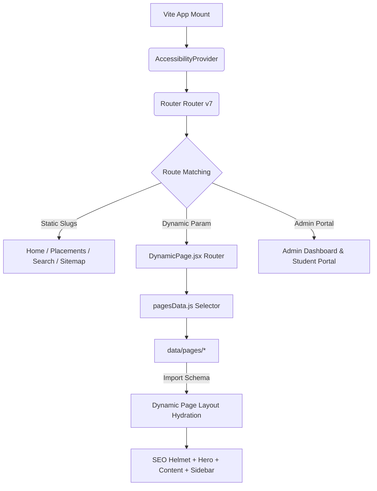

<div align="center">
  

  # 🎓 Maharaja Surajmal Institute of Technology Redesign

  **A state-of-the-art, high-performance, fully accessible, and premium conceptual overhaul of the MSIT web platform.**

  *Engineered with React 19, Vite 7, Tailwind CSS 4, and GSAP.*

  [](https://msit-website.netlify.app/)
  [](https://react.dev/)
  [](https://vitejs.dev/)
  [](https://tailwindcss.com/)
  [](https://greensock.com/gsap/)
  [](#-inclusive-accessibility-a11y-engine)

</div>

---

## 📖 Table of Contents
- [📖 Project Overview](#-project-overview)
- [✨ Key Features](#-key-features)
- [🏗️ System Architecture](#️-system-architecture)
- [🎨 Dynamic Design & UX](#-dynamic-design--ux)
- [🛠️ Tech Stack & Dependencies](#️-tech-stack--dependencies)
- [📂 Project Directory Tour](#-project-directory-tour)
- [⚙️ Developer Getting Started](#️-developer-getting-started)
- [🚀 Build & Static Prerendering](#-build--static-prerendering)
- [🤝 Contributing & License](#-contributing--license)

---

## 📖 Project Overview

Originally operating as a standard, legacy institutional directory, the Maharaja Surajmal Institute of Technology (MSIT) web platform has been completely re-architected. This conceptual redesign transforms the site into a premium, responsive **Single Page Application (SPA)** using bleeding-edge frontend paradigms.

It guarantees sub-second response times, immersive micro-interactions powered by GSAP, native styling through Tailwind v4, dynamic metadata schema hydration, client-side indexing, and an industry-grade accessibility framework.

> [!NOTE]
> This is a **conceptual portfolio redesign** built to demonstrate modern frontend engineering best practices. The official website of MSIT is located at [msit.in](http://www.msit.in).

---

## ✨ Key Features

| Feature | Legacy System | This Redesign |
| :--- | :--- | :--- |
| **Performance** | Multi-second server roundtrips, heavy assets | Sub-second loading, lazy routing, asset caching |
| **Architecture** | Hardcoded HTML directories | Decoupled JSON data + Dynamic Rendering Engine |
| **Accessibility (A11y)**| Minimal to none | Core engine for sizing, high-contrast, filters |
| **Search** | Rigid or third-party engines | Millisecond Client-side Parity Search Index |
| **SEO** | Static metadata | Real-time hydration via `react-helmet-async` |
| **Interactive Portals** | Basic forms | Student portal, skeleton screens, simulated API states |

### ⚡ Dynamic Page Engine
Rather than hardcoding dozens of identical static templates, the layout resolves route parameters dynamically through [DynamicPage.jsx](file:///Users/jayantolhyan/Desktop/my%20projects/deployed/msit%20website/src/pages/DynamicPage.jsx).
- **Data Decoupling**: All departments (CSE, IT, ECE, EEE), admissions rules, societies, and guidelines are structured as pure configuration schemas in [src/data/pages/](file:///Users/jayantolhyan/Desktop/my%20projects/deployed/msit%20website/src/data/pages/).
- **Automated Metadata**: Hydrates Open Graph tags and document headers dynamically.
- **Auto-sidebar Generation**: Builds context-specific stats, menus, and file download highlights based on current router parameters.

```js
// Example data-driven schema representation
export const cseDepartment = {
  title: "Computer Science & Engineering",
  heroImage: "/images/departments/cse.jpg",
  stats: [
    { label: "Intake", value: "240 Seats" },
    { label: "Labs", value: "12 State-of-the-art" }
  ],
  content: "..."
};
```

### 🔍 Search Indexing & Sitemap Parity
- **Instant Client-Side Search**: Locates pages, teachers, and circulars in milliseconds using a pre-compiled search index dictionary.
- **Sitemap Sync**: [searchIndex.js](file:///Users/jayantolhyan/Desktop/my%20projects/deployed/msit%20website/src/data/searchIndex.js) maps directly to the user-facing [Sitemap.jsx](file:///Users/jayantolhyan/Desktop/my%20projects/deployed/msit%20website/src/pages/Sitemap.jsx) component to guarantee zero dead-ends and 100% crawl accessibility.

### ♿ Inclusive Accessibility (A11y) Engine
The application mounts a custom `AccessibilityContext` globally, offering:
- **Responsive Sizing**: Increase or decrease baseline fonts dynamically.
- **Color Filters**: Toggle standard light/dark modes, high-contrast modes, and monochrome visual shaders.
- **Navigable Anchors**: Full keyboard compliance, skip-to-content focus routing, and semantic HTML landmarks.

### 🛡️ POSH & Accreditations Modules
- **Committee Listings**: Dedicated portal showing committee members and guidelines.
- **Complaint Lodging**: An interactive system allowing students to lodge complaints safely with instant confirmation metrics.
- **Accreditation Tracker**: Highlights NBA and NAAC ratings with elegant glassmorphic presentation cards.

---

## 🏗️ System Architecture

The following diagram illustrates how route requests flow through the React SPA routing structure down to dynamically generated pages:


```mermaid
graph TD
    A[Vite App Mount] --> B(AccessibilityProvider)
    B --> C(Router Router v7)
    C --> D{Route Matching}
    D -->|Static Slugs| E[Home / Placements / Search / Sitemap]
    D -->|Dynamic Param| F[DynamicPage.jsx Router]
    D -->|Admin Portal| G[Admin Dashboard & Student Portal]
    F --> H[pagesData.js Selector]
    H --> I[data/pages/*]
    I -->|Import Schema| J[Dynamic Page Layout Hydration]
    J --> K[SEO Helmet + Hero + Content + Sidebar]
```

---

## 🎨 Dynamic Design & UX

- **Glassmorphism & Depth**: Multi-layer blurred headers (`backdrop-filter: blur(12px)`) and cards built to stand out on high-resolution screens.
- **Fluid Layouts**: Adaptive header navigation that scales responsively without wrapping on narrow screens.
- **GSAP Animation Suite**: Implements subtle entrance, scroll-triggered page transitions, and elegant hover physics.

---

## 🛠️ Tech Stack & Dependencies

- **Core Library**: React 19 (leveraging the latest `Suspense` models & hooks)
- **Bundler & Tooling**: Vite 7 (optimized for lightning-fast HMR and build speeds)
- **Styling Pipeline**: Tailwind CSS v4 (incorporating modern native `@theme` configuration)
- **Animations**: GreenSock Animation Platform (GSAP) & `@gsap/react`
- **Routing**: React Router v7
- **SEO & Static Support**: `react-helmet-async` & `vite-plugin-sitemap`

---

## 📂 Project Directory Tour

```bash
msit-website/
├── public/                 # Static assets, branding logos, and illustrations
├── src/
│   ├── components/         # Reusable elements (Header, Footer, Layout, Spinner)
│   ├── context/            # Accessibility & Theme providers
│   ├── data/
│   │   ├── pages/          # JSON data schemas divided by academic domains
│   │   ├── facultyData.js  # Rich faculty and research listings
│   │   ├── searchIndex.js  # Synced keywords dictionary
│   │   └── pagesData.js    # Data aggregator mapping URLs to JSON schemas
│   ├── pages/              # Primary route screens (Placements, Sitemap, Dashboard, etc.)
│   ├── App.jsx             # Main routing framework configuration
│   └── main.jsx            # Application entrypoint & style imports
├── scripts/
│   └── prerender.js        # Post-build static site generator script
├── netlify.toml            # Netlify hosting configurations and security headers
└── package.json            # Scripts, devDependencies, and configurations
```

---

## ⚙️ Developer Getting Started

### Prerequisites
- **Node.js**: `v20.0.0` or higher
- **npm**: `v10.0.0` or higher

### Local Development Setup

1. **Clone the repository**:
   ```bash
   git clone https://github.com/JayantOlhyan/MSIT-.git
   cd MSIT-
   ```

2. **Install node dependencies**:
   ```bash
   npm install
   ```

3. **Launch the Vite development environment**:
   ```bash
   npm run dev
   ```
   *Open [http://localhost:5173](http://localhost:5173) in your browser.*

4. **Lint code quality**:
   ```bash
   npm run lint
   ```

---

## 🚀 Build & Static Prerendering

This project implements a post-build script to prerender static pages for crawler visibility and SEO performance.

Compile assets and execute the prerendering sequence:
```bash
npm run build
```

This sequence:
1. Compiles optimized clientside assets via Vite.
2. Invokes `scripts/prerender.js` to compile path components.
3. Generates the custom static XML sitemap inside the `dist` directory.

To test the compiled package locally, execute:
```bash
npm run preview
```

---

## 🤝 Contributing & License

Feel free to fork this project, make changes, and open a Pull Request. For major changes, please open an issue first to discuss what you'd like to update.

- **License**: [MIT](LICENSE)
- **Author**: [Jayant Olhyan](https://github.com/JayantOlhyan)

<div align="center">
  <sub>Built with ❤️ for Maharaja Surajmal Institute of Technology Redesign</sub>
</div>
