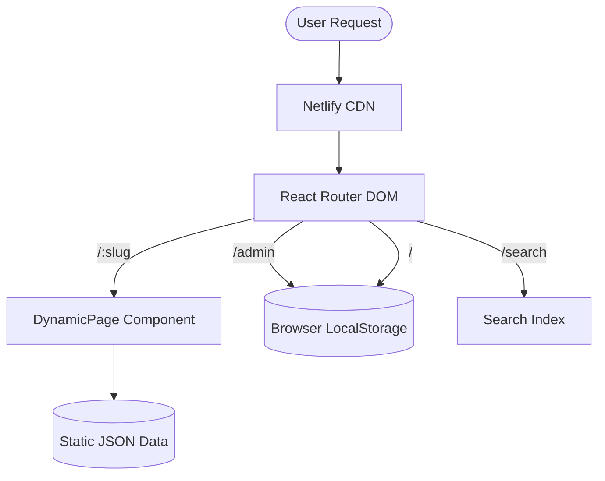

# Maharaja Surajmal Institute of Technology (MSIT) - Web Platform Redesign

> A conceptual, high-performance frontend redesign for the MSIT institutional website.

[](https://msit-website.netlify.app/)
[](https://react.dev/)
[](https://vitejs.dev/)

## Overview

This project is a premium, conceptual overhaul of the Maharaja Surajmal Institute of Technology (MSIT) web platform. It transforms the legacy institutional directory into a modern, responsive **Single Page Application (SPA)**. 

> [!IMPORTANT]
> This is a **conceptual portfolio project**. It is not the official MSIT website. The official website is located at msit.in.

## Why This Project Exists

Legacy institutional websites often suffer from slow page loads, poor accessibility, rigid mobile responsiveness, and outdated UI paradigms. This project demonstrates how a modern engineering college website should be architected: providing sub-second navigation, dynamic SEO hydration, accessible interactions, and decoupled data schemas without needing a complex backend.

## Target Users

- **Prospective Students:** Exploring courses, placements, and campus life.
- **Current Students:** Accessing circulars, syllabi, and administrative forms.
- **Faculty & Staff:** Viewing departmental data and administrative links.
- **Administrators:** Updating homepage news and events (conceptually mocked).

## Features

### Completed
- **Dynamic Content Engine**: Decoupled routing system rendering pages from static JSON schemas (`src/data/`).
- **Client-Side Search**: Instant, millisecond search indexing without external APIs.
- **Accessibility Layer**: Global state context allowing text resizing, high-contrast, and color filters.
- **SEO Pre-rendering**: Build-step script that injects accurate meta tags into static HTML output for crawlers.
- **Admin Dashboard**: Client-side CMS for adding news and events.

### Experimental / Mocked
- **Administrative CMS**: The admin dashboard is fully functional but stores data purely in the browser's `localStorage`.
- **Forms & Complaints**: Forms (like POSH complaints) simulate submission via frontend alerts without actual backend transmission.

## Architecture


```mermaid
graph TD
    User([User Request])
    Netlify[Netlify CDN]
    Router[React Router DOM]
    Dynamic[DynamicPage Component]
    Data[(Static JSON Data)]
    Local[(Browser LocalStorage)]
    Search[Search Index]

    User --> Netlify
    Netlify --> Router
    Router --> |/search| Search
    Router --> |/:slug| Dynamic
    Dynamic --> Data
    Router --> |/admin| Local
    Router --> |/| Local
```

## How It Works

The architecture entirely drops the server-side database. It operates as a pure frontend SPA:
1. **Routing**: `react-router-dom` handles navigation. 
2. **Data**: Content (departments, faculty, societies) is stored as JSON objects in `src/data/`. `DynamicPage.jsx` matches the URL slug to the JSON key and builds the layout dynamically.
3. **State Persistence**: Features requiring persistence (Admin News, Highlights, Testimonials) use `localStorage`.

## Tech Stack

### Frontend
- **Framework**: React 19
- **Build Tool**: Vite 7
- **Routing**: React Router DOM v7
- **Styling**: Tailwind CSS v4
- **Animations**: GSAP (`@gsap/react`)
- **Icons**: Lucide React
- **Meta/SEO**: React Helmet Async

### Infrastructure & Tooling
- **Deployment**: Netlify
- **Scripts**: Node.js scripts for SEO prerendering and search index generation.
- **Linting**: ESLint 9

## Repository Structure

```text
msit-website/
├── public/                 # Static assets (images, fonts)
├── scripts/
│   ├── generate-search-index.js # Compiles JSON data into searchable index
│   └── prerender.js        # Injects SEO metadata into built HTML
├── src/
│   ├── assets/             # CSS and global styles
│   ├── components/         # Reusable React components (Layout, SEO, Spinner)
│   ├── context/            # Global React Context (AccessibilityContext)
│   ├── data/               # Hardcoded JSON data simulating a database
│   │   └── pages/          # Content schemas for DynamicPage.jsx
│   ├── pages/              # Route-level React components
│   ├── App.jsx             # Router configuration
│   └── main.jsx            # Entry point
├── .env.example            # Environment variables template
├── eslint.config.js        # Linting rules
├── netlify.toml            # Deployment configuration and security headers
├── package.json            # Dependencies and commands
└── vite.config.js          # Vite configuration and sitemap routing
```

## Prerequisites

- Node.js (v18 or higher recommended)
- npm (v9 or higher)

## Local Development

1. **Clone the repository:**
   ```bash
   git clone <repository-url>
   cd "msit website"
   ```

2. **Install dependencies:**
   ```bash
   npm install
   ```

3. **Configure environment:**
   ```bash
   cp .env.example .env
   ```

4. **Start the development server:**
   ```bash
   npm run dev
   ```

## Environment Variables

| Variable | Required | Purpose | Example |
| -------- | -------- | ------- | ------- |
| `VITE_SITE_URL` | Yes | Defines the canonical base URL for SEO and Sitemap generation. | `https://msit-website.netlify.app` |
| `VITE_API_URL` | No | Placeholder for future backend integration. | |

## Database

> **Not yet implemented.** 

This project does not use a traditional database. It relies on:
1. **Static Data**: Hardcoded `.js` files in `src/data/` (e.g., `facultyData.js`, `societiesData.js`).
2. **Local Storage**: The `AdminDashboard.jsx` writes mocked news and events to the browser's `localStorage` (`msit_events_v2`, `msit_highlights`, etc.).

## API

> **Not yet implemented.**

There is no backend API. All routing and data fetching occurs locally on the client.

## Authentication

> **Partially Implemented (Mock).**

Authentication is simulated in the Admin Dashboard (`/admin`). 
- **Mechanism**: Hardcoded credentials checked client-side.
- **Session**: A boolean flag is stored in component state to simulate a session.
- **Security**: There is zero actual security securing the "admin" routes; it is purely for UI demonstration.

## Security

Actual security mechanisms configured in the repository:
- **Netlify Headers (`netlify.toml`)**:
  - `X-Frame-Options: DENY` (Clickjacking protection)
  - `X-XSS-Protection: 1; mode=block`
  - `X-Content-Type-Options: nosniff`
  - `Strict-Transport-Security: max-age=31536000` (HSTS)
  - `Content-Security-Policy`: Restricts scripts and styles to self and trusted CDNs.
- **Data Protection**: As there is no backend or real user data handled, traditional data breach vectors are minimal.

## Performance

- **Asset Optimization**: High-priority images use `fetchpriority="high"` and `loading="eager"`.
- **Pre-rendering**: Critical SEO tags are injected into the static HTML via `scripts/prerender.js`, preventing crawler delays.
- **Code Splitting**: Routes are lazy-loaded in `App.jsx` using `React.lazy()` and `<Suspense>`.
- **Animations**: GSAP is used sparingly for performant, hardware-accelerated transitions.

## Testing

> **Not yet implemented.**

There is currently no test suite (Jest, Cypress, etc.) configured in this repository.

## Deployment

This project is deployed to Netlify using the configuration in `netlify.toml`.

**Build Process:**
```bash
npm run build
```
*Note: The custom build script in `package.json` automatically runs `generate-search-index.js`, then `vite build`, and finishes with `prerender.js`.*

**Netlify Configuration:**
- Redirection handles SPA routing (`/* -> /index.html` with status 200).
- Static assets under `/assets/*` are given immutable cache headers.

## Development Workflow

- **Formatting & Linting**: Use `npm run lint` to run ESLint across the codebase.
- **Adding Pages**: To add a new informational page, define a new JSON object in `src/data/pagesData.js` and add the slug to the `vite.config.js` sitemap `dynamicRoutes` array.

## Known Limitations

- **No Persistence Across Devices**: Because the CMS relies on `localStorage`, any news or events added via the Admin Dashboard will only be visible on the specific browser where they were created. Clearing browser data will delete them.
- **No Backend**: Forms (Contact, POSH complaints) do not actually send emails or store data. They rely on dummy JavaScript `alert()` functions.
- **Missing Tests**: No unit or integration tests exist.
- **SEO Static Limits**: While `prerender.js` injects basic tags, deep dynamic pages rely heavily on client-side React rendering, which may still struggle with older search engine crawlers.

## Roadmap

### Planned
- Integrate a headless CMS (e.g., Sanity or Strapi) to replace `localStorage` and static JSON data.
- Add proper backend endpoints for form submissions.
- Implement an actual authentication layer (e.g., Firebase Auth or NextAuth) for the Admin panel.
- Add end-to-end testing with Cypress or Playwright.

## Troubleshooting

### Search index not updating
**Resolution:** Run `npm run generate-search-index` to rebuild the index mapping from the static JSON files.

### 404 on direct page loads (if deployed outside Netlify)
**Cause:** SPAs require wildcard routing to `index.html`.
**Resolution:** Ensure your hosting provider is configured to redirect all missing routes to `index.html`, mimicking the `netlify.toml` `[[redirects]]` block.

## AI / Developer Orientation

If modifying this repository:
- **Routing**: Start at `src/App.jsx`.
- **Adding Content**: Do not create new React components for standard text pages. Edit `src/data/pagesData.js` or files in `src/data/pages/`.
- **Styling**: Tailwind is configured. Global CSS overrides are in `src/index.css`.
- **SEO**: If you add new static routes, add them to `dynamicRoutes` in `vite.config.js` AND update `staticRoutes` in `scripts/prerender.js` so they index correctly.
